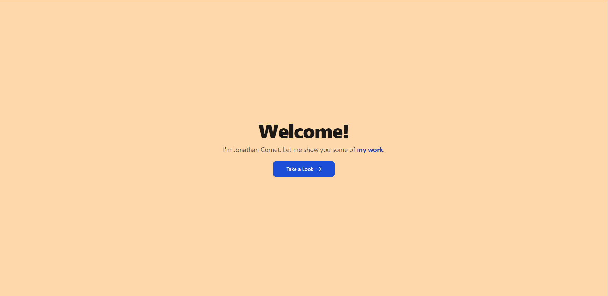
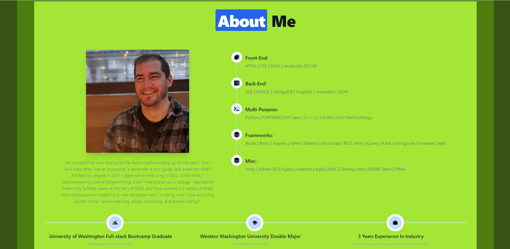
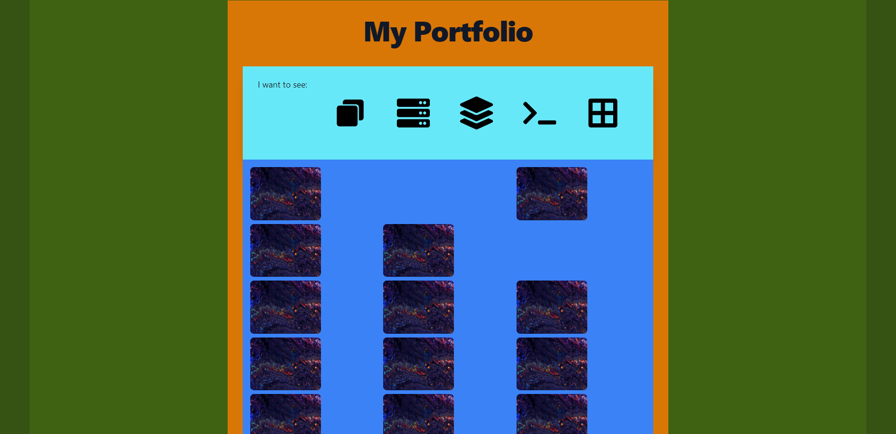
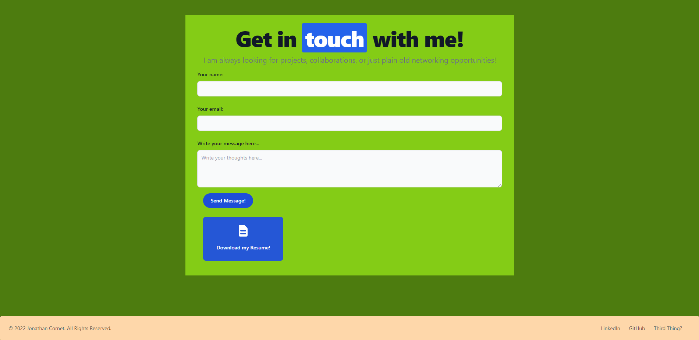

# Personal Portfolio Page

## User Story

ADD USER STORY

## Description

This is my personal portfolio page, made with React.js! Here, I showcase my different projects while also showing some of my React and design skillset. This application also meets the following acceptance criteria:

ADD ACCEPTANCE CRITERIA

The landing section looks as follows:

The about section looks as follows:

The portfolio section looks as follows:

The contact section looks as follows:

The following link leads to the website:

www.jonathancornet.com

## Table of Contents

- [Installation](#installation)
- [Usage](#usage)
- [Credits](#credits)
- [Contribute](#contribute)
- [Tests](#tests)
- [Questions](#questions)
- [License](#license)

## Installation

ADD INTALLATION

## Usage

ADD USAGE

## Credits

ADD CREDITS

## Contribute

This is a completed portfolio page and does not need any contributions.

## Tests

There is no testing for this application.

## Questions

Feel free to reach out to me with questions:

Find my GitHub at: [GitHub Profile](https://github.com/cornetj13)

Email me at: cornetj2@gmail.com

## License

This source code is licensed under the MIT license found in the LICENSE file in the root directory of this source tree.